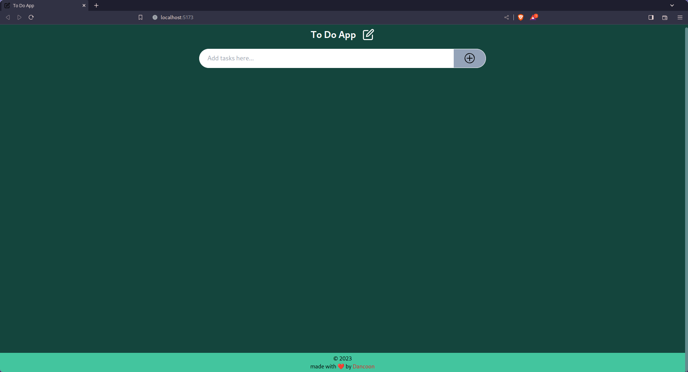
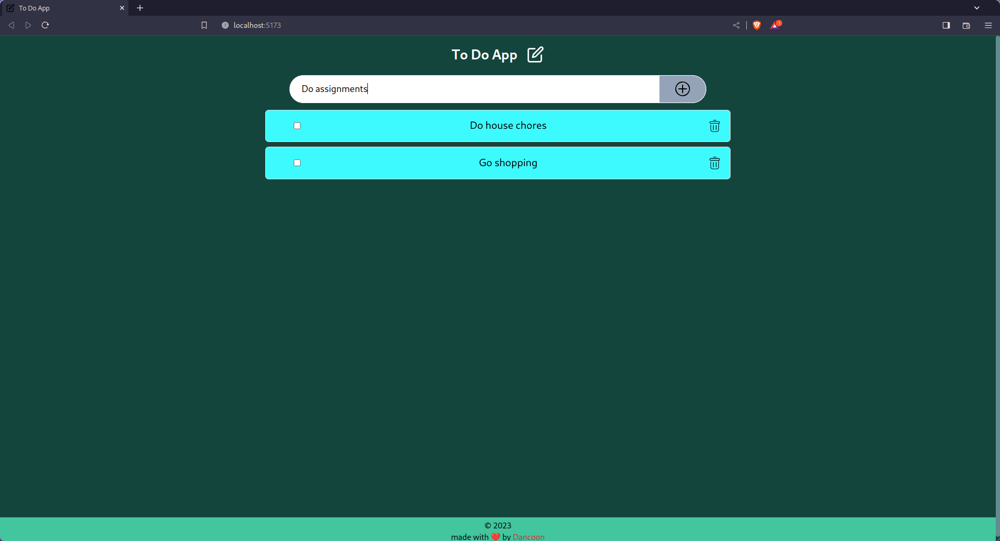
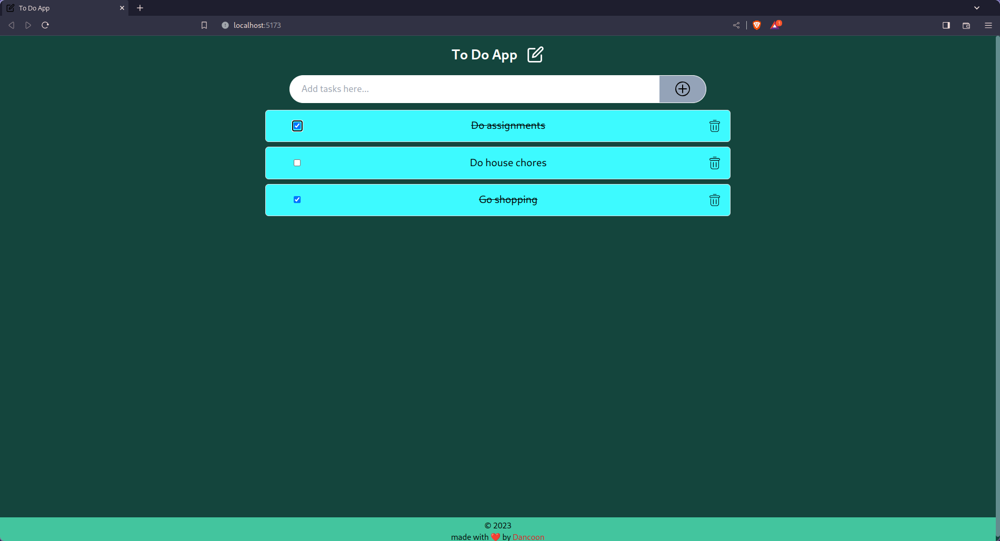
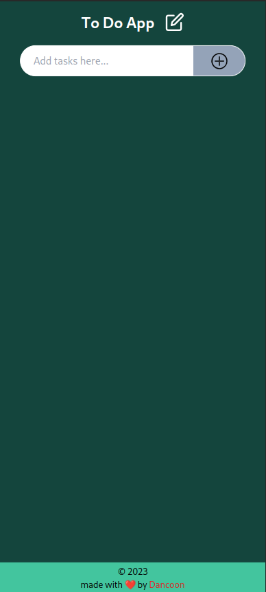
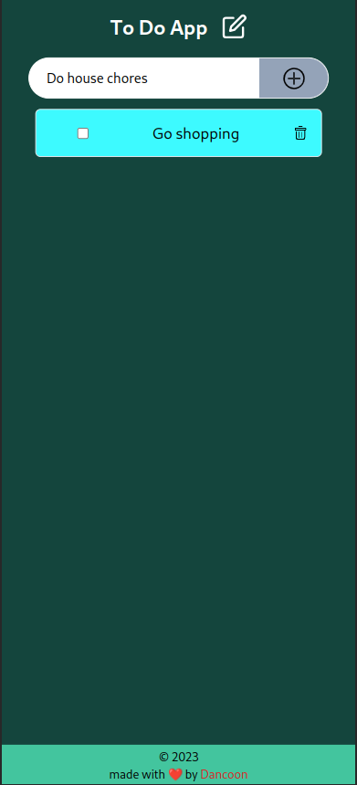
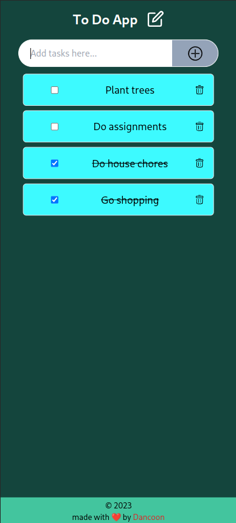

# React TodoApp

A simple TodoApp built with React and TypeScript.

## Table of Contents

- [Introduction](#introduction)
- [Features](#features)
- [Installation](#installation)
- [Usage](#usage)
- [Folder Structure](#folder-structure)
- [Dependencies](#dependencies)
- [Contributing](#contributing)
- [License](#license)

## Introduction

This project is a TodoApp developed using React and TypeScript. It allows users to add, delete, and mark tasks as completed.

## Features

- Add new tasks
- Mark tasks as completed
- Delete tasks
- Store tasks in local storage

### Desktop





### Mobile

 



## Installation

1. Clone the repository:

```bash
git clone https://github.com/dancoon/ToDoApp.git
```

2. Change into the project directory:

```bash
cd 'ToDo App'
```

3. Install dependencies:

```bash
npm install
```

## Usage

To start the development server, run:

```bash
npm run dev
```

Open your browser and navigate to `http://localhost:5173` to view the TodoApp.

## Folder Structure

The project follows a simple folder structure:

```
public/
|-- edit_icon.svg
src/
|-- assets
|   |-- add_icon.svg
|   |-- delete.svg
|   |-- edit_icon.svg
|-- components/
|   |-- Footer.tsx
|   |-- Form.tsx
|   |-- Header.tsx
|   |-- Main.tsx
|   |-- Tasks.tsx
|-- interfaces/
|   |-- Props.tsx
|-- pages/
|   |-- Home.tsx
|-- App.tsx
|-- index.css
|-- main.tsx
|-- routes.tsx
|-- ...
```

- `components/`: Contains React components responsible for rendering different parts of the TodoApp.
- `interfaces/`: Contains TypeScript interface definitions.

## Dependencies

- React
- TypeScript
- Tailwindcss

## Authors

Developed by Ian Dancun - [github](https://github.com/dancoon/) / [linkedIn](https://www.linkedin.com/in/dancoon/)\
UI/UX designed by Javan Odhiambo - [github](https://github.com/Javan-Odhiambo) / [linkedIn](https://www.linkedin.com/in/javan-otieno/)

## Contributing

Contributions are welcome! Feel free to open an issue or submit a pull request.